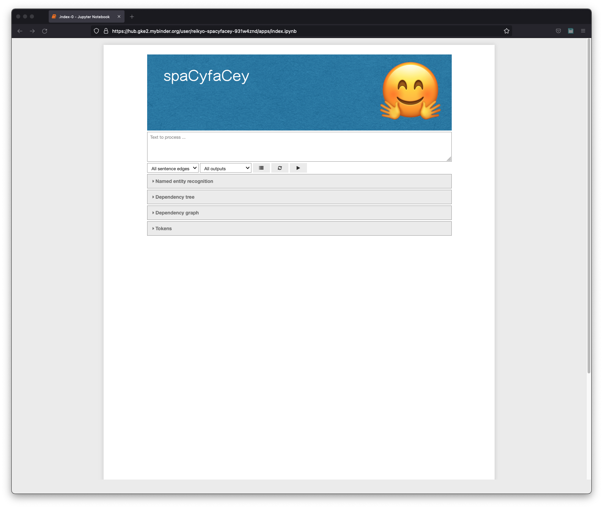
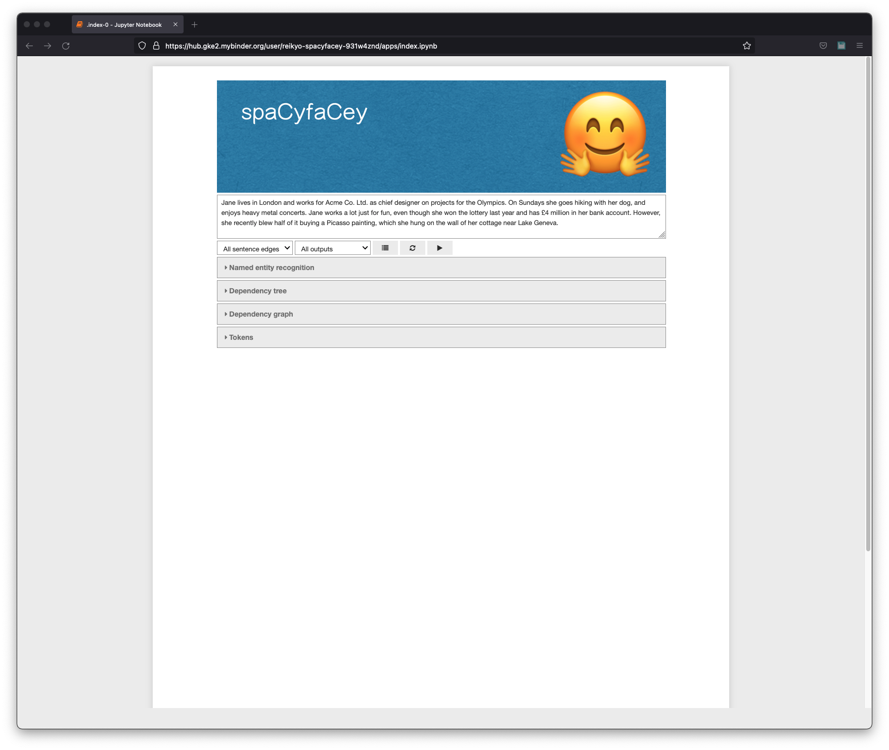
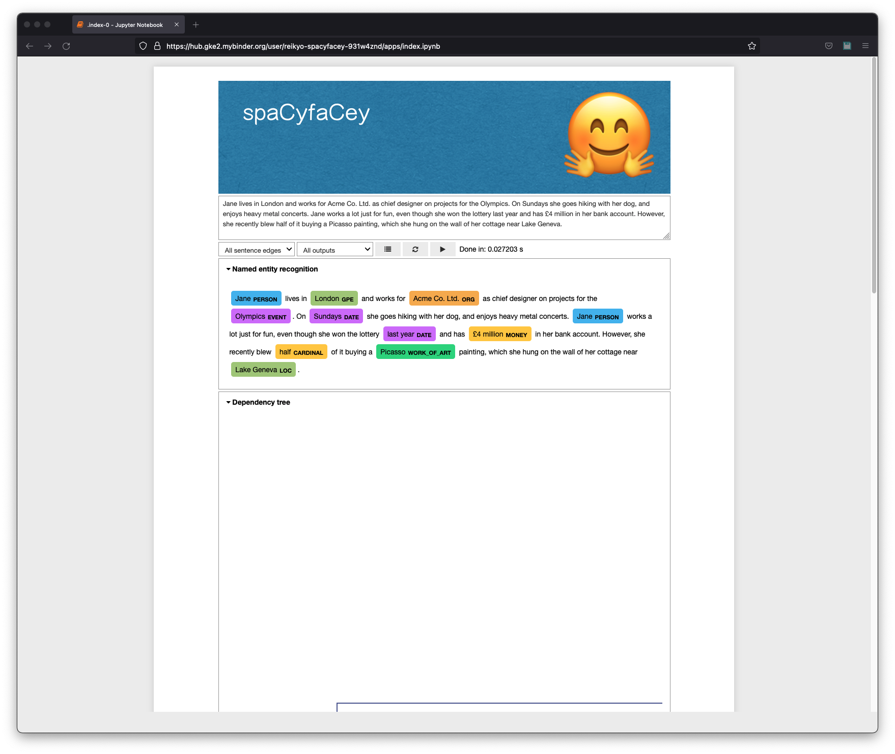
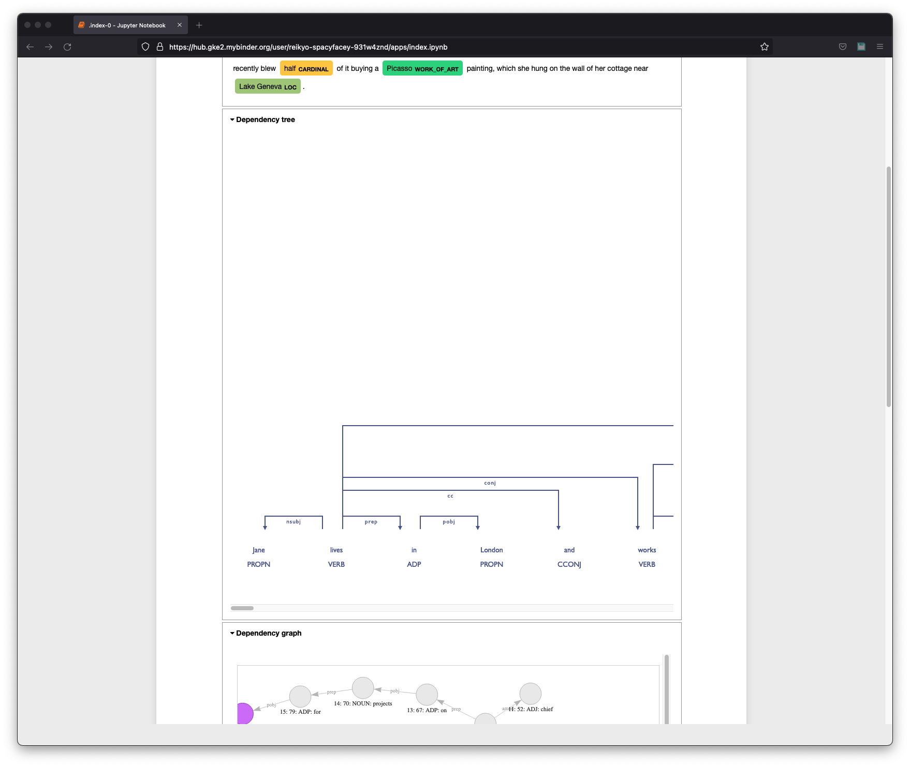
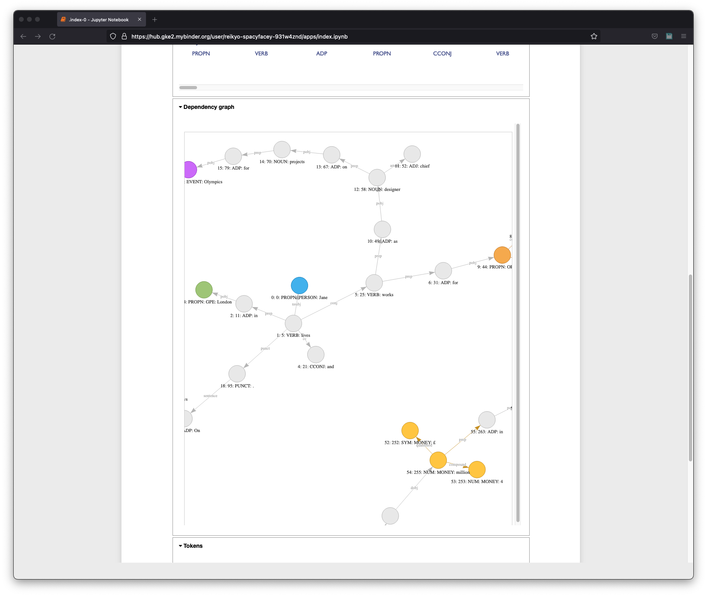
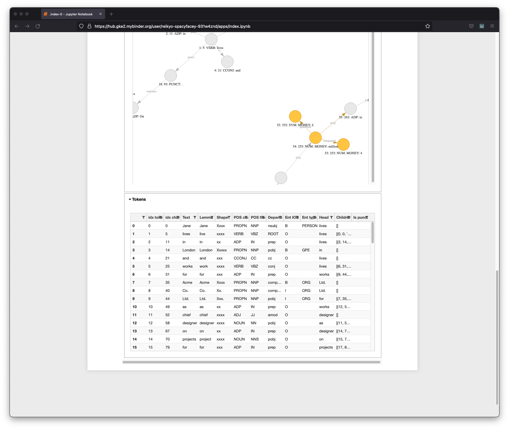

[](https://spacy.io)
[](https://mybinder.org/v2/gh/Reikyo/spaCyfaCey/master?urlpath=%2Fapps%2Findex.ipynb)

# spaCyfaCey

This Python code runs the popular Natural Language Processing (NLP) library called [spaCy](https://spacy.io), wrapped up as a standalone web application for automated launch in a headless (i.e. hidden controls) Jupyter notebook via a [Binder](https://mybinder.org) virtual machine. Just click the launch button at the top of this page, and a VM will be spun up with all necessary dependencies ready to go. This should only take a couple of minutes, but it depends on the current usage of the Binder service. Note that once loaded, the application will time out after a couple of minutes of inactivity, and the link cannot be refreshed. You will need to start again by launching a new instance via the button at the top of this page.

Once the VM is ready, you will be presented with a simple graphical user interface in the browser for inputting your text, running the language model on it, and seeing the processed output in various forms as detailed below. The spaCy library has a range of different models trained by machine learning, which drive how the library processes input. These models are "small", "medium", and "large", in order of increasing size and increasing accuracy. By default the code herein uses the large model, so you can see spaCy working at its best.

The main reason for this project is simply to illustrate the basics of using spaCy and making such a browser application with Jupyter, by inspecting and downloading the files and running locally. If you really want to try out spaCy itself in a better way, still without the hassle of installing it yourself, then just head to the [official developer website](https://explosion.ai/software) and check out the "Demos" section for a set of applications that can run in your browser without any pre-loading required.

If you dig into the files here, you will see some disabled code related to [neuralcoref](https://huggingface.co/coref). This is a spaCy add-on from developer [Hugging Face](https://huggingface.co), and was half of the reason behind the hilarious name of this little project. However, even though this add-on has been coaxed to work in local testing (which required a bit of jiggling, including installation from source and a lower spaCy version of v2.3.7), there seems to be a crashing issue when running in a Binder VM. The neuralcoref code sections have therefore been disabled, but are left in place for those who wish to try downloading and running locally.

---

## Outputs

<br/>


<br/>



<br/>

The above images show the running application, including a full set of example outputs. In order of top row images from left to right, then bottom row images from left to right, we have:

- Empty GUI as it appears on launch
- Some inserted text pre-running
- Named Entity Recognition (NER) output
- Dependency tree output
- Dependency graph output
- Tokens table output

Both the dependency tree and the dependency graph show essentially the same information, but the graph has the added extra of highlighting the named entities with the same colours as used in the dedicated NER output, and also includes an edge between the end of each sentence and the beginning of the next. Seeing as these sentence edges are not standard and are not part of the dependency tree, they can be toggled from the dependency graph output via the first dropdown menu in the controls section just beneath the text input section. The input will need to be re-processed each time this selection is changed. The second dropdown menu allows the user to select either all outputs to be shown (default), or a specific single output.

A "token" is something that spaCy regards as a single linguistic unit, typically a single word or punctuation symbol. The output tokens table shows a selection of information that spaCy applies to each token:

- `idx token` - Index of the token, starting from zero
- `idx char` - Index of the first character of the token, starting from zero
- `Text` - Form of the token as seen in the given text
- `Lemma` - Lemmatised form of the token e.g. "worked" has lemma "work", "loves" has lemma "love"
- `Shape` - Approximate shape of the token e.g. "Xxxx" for a capitalised medium length word, "xx" for a lowercase short word, and so on. Note that the number of "x" doesn't necessarily match the number of characters in the token.
- `POS coarse` - Part Of Speech in its coarsest description e.g. "NOUN", "VERB" etc.
- `POS fine` - Part Of Speech in its finest description e.g. "NN" (singular or mass noun), "VB" (base form verb) etc.
- `Dependency` - Dependency (i.e. relationship) of the token with respect to its "head"/"parent" token e.g. "nsubj" (nominal subject), "pobj" (preposition object)
- `Ent IOB` - Position of the token in a named entity. "B" means the beginning or sole token, "I" means an inside token (which includes the final token of the entity), and "O" means an outside token (which means not in a named entity at all).
- `Ent type` - Type of the named entity that the token is a part of, if it is part of one at all
- `Head` - The "head"/"parent" token of this token i.e. that which governs the dependency of this token
- `Children` - The "child" tokens of this token i.e. that which have their dependency governed by this token. Each element in this list has three sub-elements, namely the token index, character index, and text of the child token, respectively.
- `Is punct` - Boolean true/false as to whether or not spaCy takes this token to be punctuation. There are many other such booleans available if you dig further into spaCy e.g. `is_alpha`, `is_digit`, `is_space` ...

---

## Part Of Speech (POS) coarse

- `ADJ` - Adjective
- `NOUN` - Noun
- `PROPN` - Proper noun
- `PRON` - Pronoun
- `ADV` - Adverb
- `VERB` - Verb
- `DET` - Determiner
- `CONJ` - Conjunction
- `SCONJ` - Subordinating conjunction
- `INTJ` - Interjection
- `NUM` - Numeral
- `SYM` - Symbol
- `PUNCT` - Punctuation
- `PART` - Particle
- `AUX` - Auxiliary
- `ADP` - Adposition
- `X` - Other

---

## Part Of Speech (POS) fine (a.k.a. "tag")

- `JJ` - Adjective
- `JJR` - Adjective, comparative
- `JJS` - Adjective, superlative
- `NN` - Noun, singular or mass
- `NNP` - Noun, proper singular
- `NNS` - Noun, plural
- `NNPS` - Noun, proper plural
- `PRP` - Pronoun, personal
- `WP` - Wh-pronoun, personal
- `PRP$` - Pronoun, possessive
- `WP$` - Wh-pronoun, possessive
- `RB` - Adverb
- `RBR` - Adverb, comparative
- `RBS` - Adverb, superlative
- `RP` - Adverb, particle
- `WRB` - Wh-adverb
- `VB` - Verb, base form
- `VBG` - Verb, gerund or present participle
- `VBZ` - Verb, 3rd person singular present
- `VBP` - Verb, non-3rd person singular present
- `VBD` - Verb, past tense
- `VBN` - Verb, past participle
- `MD` - Verb, modal auxiliary
- `PDT` - Predeterminer
- `DT` - Determiner
- `WDT` - Wh-determiner
- `CC` - Conjunction, coordinating
- `IN` - Conjunction, subordinating or preposition
- `EX` - Existential there
- `TO` - Infinitival "to"
- `UH` - Interjection
- `AFX` - Affix
- `POS` - Possessive ending
- `CD` - Cardinal number
- `FW` - Foreign word
- `LS` - List item marker
- `ADD` - email
- `SYM` - Symbol
- `$` - Symbol, currency
- `-LRB-` - Left round bracket
- `-RRB-` - Right round bracket
- `NFP` - Superfluous punctuation
- `HYPH` - Punctuation mark, hyphen
- `,` - Punctuation mark, comma
- `.` - Punctuation mark, sentence closer
- `:` - Punctuation mark, colon or ellipsis
- ``` `` ``` - Opening quotation mark
- `''` - Closing quotation mark
- `XX` - Unknown

---

## Dependency

- `ROOT` - None
- `acl` - Clausal modifier of noun (adjectival clause)
- `acomp` - Adjectival complement
- `advcl` - Adverbial clause modifier
- `advmod` - Adverbial modifier
- `agent` - Agent
- `amod` - Adjectival modifier
- `appos` - Appositional modifier
- `attr` - Attribute
- `aux` - Auxiliary
- `auxpass` - Auxiliary (passive)
- `case` - Case marking
- `cc` - Coordinating conjunction
- `ccomp` - Clausal complement
- `compound` - Compound
- `conj` - Conjunct
- `csubj` - Clausal subject
- `csubjpass` - Clausal subject (passive)
- `dative` - Dative
- `dep` - Unclassified dependent
- `det` - Determiner
- `dobj` - Direct object
- `expl` - Expletive
- `intj` - Interjection
- `mark` - Marker
- `meta` - Meta modifier
- `neg` - Negation modifier
- `nmod` - Modifier of nominal
- `npadvmod` - Noun phrase as adverbial modifier
- `nsubj` - Nominal subject
- `nsubjpass` - Nominal subject (passive)
- `nummod` - Numeric modifier
- `oprd` - Object predicate
- `parataxis` - Parataxis
- `pcomp` - Complement of preposition
- `pobj` - Object of preposition
- `poss` - Possession modifier
- `preconj` - Pre-correlative conjunction
- `predet` - None
- `prep` - Prepositional modifier
- `prt` - Particle
- `punct` - Punctuation
- `quantmod` - Modifier of quantifier
- `relcl` - Relative clause modifier
- `xcomp` - Open clausal complement

---

## Named Entity Recognition (NER)

- `PERSON` - People, including fictional
- `ORG` - Companies, agencies, institutions, etc.
- `GPE` - Countries, cities, states
- `LOC` - Non-GPE locations, mountain ranges, bodies of water
- `FAC` - Buildings, airports, highways, bridges, etc.
- `NORP` - Nationalities or religious or political groups
- `DATE` - Absolute or relative dates or periods
- `TIME` - Times smaller than a day
- `EVENT` - Named hurricanes, battles, wars, sports events, etc.
- `CARDINAL` - Numerals that do not fall under another type
- `ORDINAL` - "first", "second", etc.
- `QUANTITY` - Measurements, as of weight or distance
- `PERCENT` - Percentage, including "%"
- `MONEY` - Monetary values, including unit
- `PRODUCT` - Objects, vehicles, foods, etc. (not services)
- `WORK_OF_ART` - Titles of books, songs, etc.
- `LANGUAGE` - Any named language
- `LAW` - Named documents made into laws
